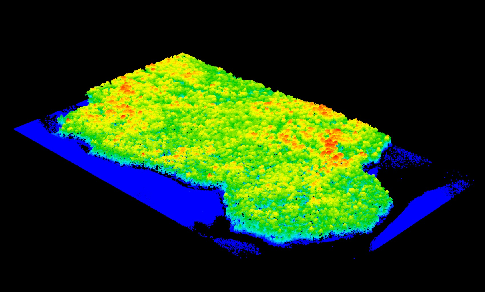
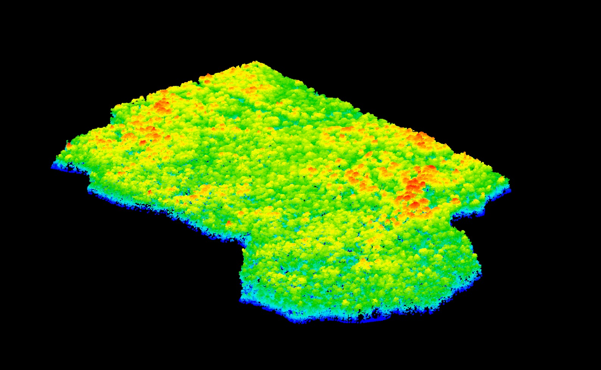

The function `classifyFromShapefile` enable to classifiy each point from geographic data contained in a shapefile. So many applications can derived from this function. The following example shows how to revove lakes from the data using this tools.

## Load the data and read a shapefile

    LASfile <- system.file("extdata", "Megaplot.las", package="lidR")
    shapefile_dir <- system.file("extdata", package = "lidR")
    
    lidar = LoadLidar(LASfile)
    lake = rgdal::readOGR(shapefile_dir, "lac_ontario_UTM17")
    
## Classify the points

The function check for each polygon contained in the shapefile if the points are in or out the polygons. If a point is in a polygon the function attribute to this point the value of the shapefile's field passed in the parameter `field`. If the field does not exist it attributes a boolean value to the point. In the following example the field `lake` does not exist in the shapefile. The function creates a new field in the `lidar` object named `lake` with a binary information. `TRUE` the point is in a lake, `FALSE` the point is not in a lake.

    lidar %<>% classifyFromShapefile(lake, field="lake")
    
## Filter the lakes to keep only forest

    forest = lidar %>% extract(lake == FALSE)
    

