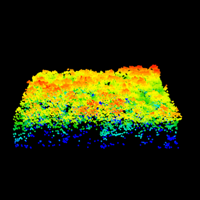
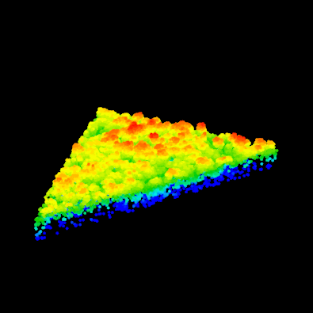

The `clip` family functions enable extraction of pieces of LiDAR data based on coordinates and shapes: 

    clipCircle(lidar, xcenter, ycenter, radius)
    clipRectangle(lidar, xleft, ybottom, xright, ytop)
    clipPolygon(lidar, x, y)
    
The option parameter `inside` allows for retention of data inside or outside the shape. The default behavior is `inside = TRUE`.

  
